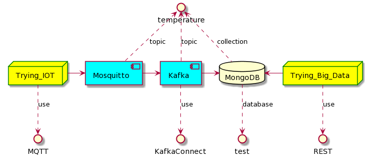

# About The Project

## What you will need

* Docker
* Docker Compose

## What the project uses

* Java 11
* Spring Boot
* MongoDB
* Kafka
* Mosquitto

## How It Works



* The `Trying_IOT` application generates the following data from time to time:

```
{
  "temperature": {{random number between 30 and 40}},
  "userId": {{generated uuid for that instance}},
  "createdAt": {{now as milliseconds}}
}
```

* Then, sends to `Mosquitto` using MQTT protocol. `Mosquitto` sends to `Kafka`. For now, there's no transformation of data.
* So, `Kafka` proxies the data to `MongoDB` using a `Kafka Connect MongoDB`
* The `Trying_Big_Data` application then reads the data from MongoDB and apply the operations (e.g. median, max, min)

<details>
<summary>PlantUML Code</summary>

```
@startuml
database MongoDB
node Trying_IOT
node Trying_Big_Data

Trying_IOT -> [Mosquitto]
Trying_IOT ..> MQTT : use
[Mosquitto] -> [Kafka]
[Mosquitto] .up.> temperature : topic
[Kafka] .up.> temperature : topic
[Kafka] ..> KafkaConnect : use
[Kafka] -> MongoDB
MongoDB <- Trying_Big_Data
MongoDB .up.> temperature : collection
MongoDB ..> test : database
Trying_Big_Data ..> REST : use

skinparam node {
    borderColor Green
    backgroundColor Yellow
    backgroundColor<<shared node>> Magenta
}

skinparam component {
    backgroundColor Aqua
}
@enduml
```

</details>

# How To Start

* Run this command to build the projects

`docker-compose build`

* Then, start these applications:

`docker-compose up -d zookeeper kafka mosquitto mongo-db`

* After Kafka started, you need to create the topic in Kafka:

`docker exec -it kafka kafka-topics --create --topic temperature --partitions 1 --replication-factor 1 --if-not-exists --zookeeper zookeeper:32181`

* It should return `Created topic temperature.`

* Kafka-Connect image doesn't have some plugins. We need to download them and restart the container.

`docker-compose up -d kafka-connect && docker exec kafka-connect confluent-hub install --no-prompt hpgrahsl/kafka-connect-mongodb:1.4.0 && docker exec kafka-connect confluent-hub install --no-prompt confluentinc/kafka-connect-mqtt:1.3.0 && docker stop kafka-connect`

`docker-compose up -d kafka-connect`

* **NOTE** Kafka-Connect takes a while to be functional, so when you execute the following commands it might return nothing or an error.
* After that, we need to configure the Kafka-Connect, so we need to execute the following commands **UNTIL YOU GET THE EXPECTED RESPONSES** :

```
docker exec kafka-connect curl -s -X POST \
  -H "Content-Type: application/json" \
  --data ' {
      "name": "mongo-sink",
      "config": {
        "connector.class":"at.grahsl.kafka.connect.mongodb.MongoDbSinkConnector",
        "tasks.max":"1",
        "topics":"temperature",
        "connection.uri":"mongodb://mongo-db/test?retryWrites=true",
        "mongodb.connection.uri":"mongodb://mongo-db/test?retryWrites=true",
        "database":"test",
        "collection":"temperature",
        "key.converter":"org.apache.kafka.connect.json.JsonConverter",
        "key.converter.schemas.enable":false,
        "value.converter":"org.apache.kafka.connect.json.JsonConverter",
        "value.converter.schemas.enable":false
      }
}' \
  http://localhost:8083/connectors
```

* **EXPECTED RESPONSE**: 

```
{"name":"mongo-sink","config":{"connector.class":"at.grahsl.kafka.connect.mongodb.MongoDbSinkConnector","tasks.max":"1","topics":"temperature","connection.uri":"mongodb://mongo-db/test?retryWrites=true","mongodb.connection.uri":"mongodb://mongo-db/test?retryWrites=true","database":"test","collection":"temperature","key.converter":"org.apache.kafka.connect.json.JsonConverter","key.converter.schemas.enable":"false","value.converter":"org.apache.kafka.connect.json.JsonConverter","value.converter.schemas.enable":"false","name":"mongo-sink"},"tasks":[],"type":"sink"}
```

* Same thing with this command:

```
docker exec kafka-connect curl -s -X POST \
  -H "Content-Type: application/json" \
  --data '{"name":"try-mqtt-source","config":{"connector.class":"io.confluent.connect.mqtt.MqttSourceConnector","tasks.max":1,"mqtt.server.uri":"tcp://mosquitto:1883","mqtt.topics":"temperature","kafka.topic":"temperature","value.converter":"org.apache.kafka.connect.converters.ByteArrayConverter","confluent.topic.bootstrap.servers":"kafka:9092","confluent.topic.replication.factor":1}}' \
  http://localhost:8083/connectors
```

* **EXPECTED RESPONSE**:

```
{"name":"try-mqtt-source","config":{"connector.class":"io.confluent.connect.mqtt.MqttSourceConnector","tasks.max":"1","mqtt.server.uri":"tcp://mosquitto:1883","mqtt.topics":"temperature","kafka.topic":"temperature","value.converter":"org.apache.kafka.connect.converters.ByteArrayConverter","confluent.topic.bootstrap.servers":"kafka:9092","confluent.topic.replication.factor":"1","name":"try-mqtt-source"},"tasks":[],"type":"source"}
```

* Now we can start the `iot` application to generate data for us.

`docker-compose up -d iot`

* If you want to scale the application, just run:

`docker-compose up -d --scale iot=3`

* Now it's time to start the web service application:

`docker-compose up -d big-data`

* When the application starts, you can go to http://localhost:8080/ and try some requests using the Swagger.

* Note: This site might be useful: https://currentmillis.com/